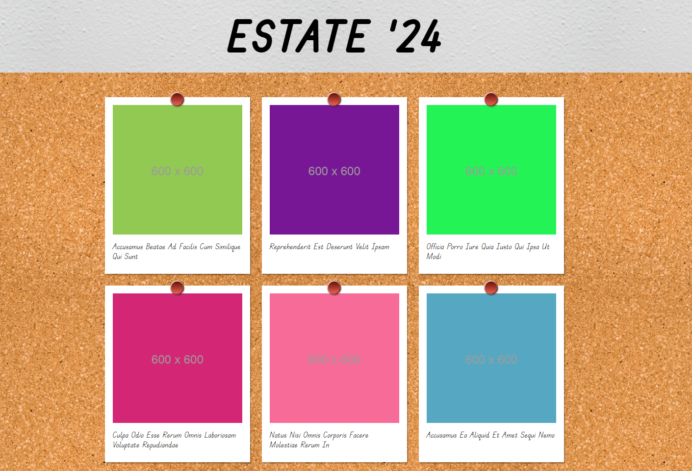
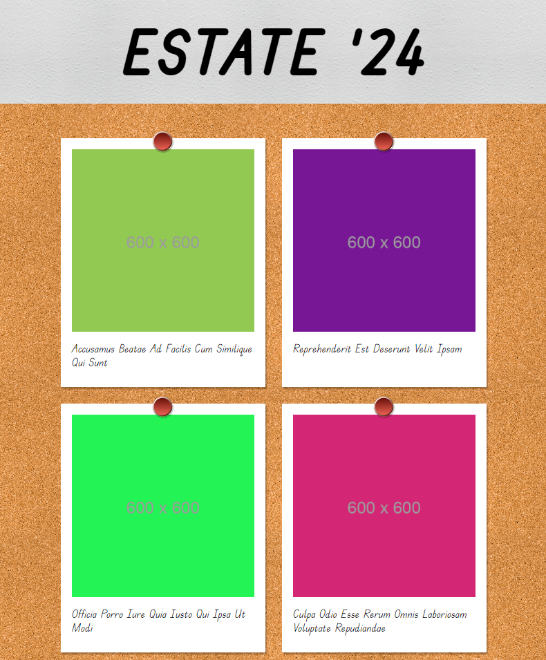

# Photo Blog

---

## Descrizione

Riprodurre un blog fotografico su base del layout dell'immagine qui sotto. \
Gli elementi del blog devono essere generati dinamicamente attraverso la chiamata ad un' API. \
Il lavoro del primo giorno prevede tre milestone da raggiungere.

---

## Giorno 1

### Milestone 1

Riprodurre la grafica proposta in maniera statica: utilizzando soltanto HTML e CSS e riproducendo una singola fotografia (sfruttando un'immagine a scelta tra quelle disponibili).

### Milestone 2

Utilizzando Postman, testare una chiamata a questo endpoint: \
https://lanciweb.github.io/demo/api/pictures/ \
Studiare la risposta e i dati che fornisce iniziando a pensare a come poterli sfruttare.

### Milestone 3

Inserire un foglio JavaScript ed effettuare una chiamata AJAX all’API, sfruttando la risposta per generare dinamicamente in pagina una serie di fotografie.

### Bonus

Rendere la pagina responsive, in modo che su mobile e tablet le foto si dispongano man mano una sotto l’altra ed il titolo abbia una dimensione adeguata. \
Usare le immagini seguenti come esempio di layout per tablet e mobile.

---

## Giorno 2

### Milestone 1

Fare in modo di creare un overlay che copra l’intera pagina e all’interno, centrata, disporre un’immagine qualunque ed un button di chiusura.

### Milestone 2

Far sparire l’overlay con l’aiuto di una classe CSS che imposti il "display: none" .
Dopodiché far sì che cliccando una qualunque foto. L’overlay ricompaia.
Cliccando invece il button di chiusura, l’overlay scompare nuovamente.

### Milestone 3

Inserire il pezzo di logica finale: quando una foto viene cliccata, dove essere proprio quella foto a essere mostrata all’interno dell’overlay.

### Bonus

Spostandosi col mouse sopra le foto, queste si zoommano, ruotano di 10 gradi e la loro ombra aumenta, il tutto in manierà fluida. Inoltre il mouse diventa un puntatore, per far capire all’utente che può cliccare.